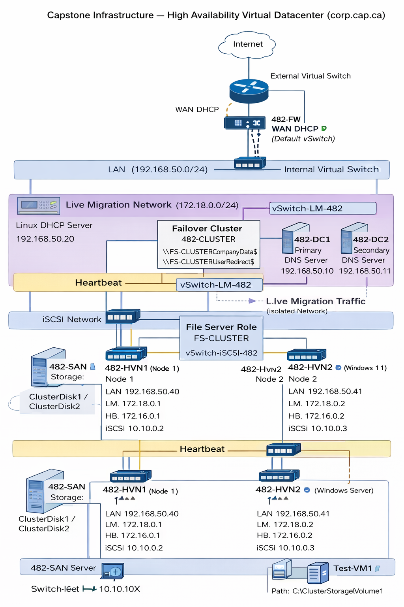

# High Availability Infrastructure – Capstone Project

## 📌 Overview

This project demonstrates the design and implementation of a **highly available virtual infrastructure** using Microsoft Hyper-V, Failover Clustering, and Active Directory.

The goal was to simulate a **real-world enterprise environment** with redundancy, centralized management, and minimal service downtime.

---

## 🧱 Architecture Summary

The environment consists of:

* **2 Hyper-V Hosts (Cluster Nodes)**
* **Shared Storage (iSCSI / Cluster Shared Volumes)**
* **Redundant Domain Controllers**
* **Clustered File Server (High Availability)**
* **Client Machine for Testing**

---

## ⚙️ Key Technologies

* Hyper-V Virtualization
* Failover Clustering
* iSCSI Storage
* Active Directory Domain Services (AD DS)
* Group Policy (GPO)
* Windows Server Core
* PowerShell Administration

---

## 🖥️ Infrastructure Components

| Component | Role                        |
| --------- | --------------------------- |
| 482-HVN1  | Hyper-V Cluster Node 1      |
| 482-HVN2  | Hyper-V Cluster Node 2      |
| 482-DC1   | Primary Domain Controller   |
| 482-DC2   | Secondary Domain Controller |
| 482-CL-01 | Client Machine              |
| 482-SAN   | iSCSI Storage Server        |
| 482-FW    | pfSense Firewall            |

---

## 🌐 Network Design

| Network         | Purpose                             |
| --------------- | ----------------------------------- |
| 192.168.50.0/24 | LAN (Client & Server Communication) |
| 10.10.10.0/24   | iSCSI Storage Network               |
| 172.16.0.0      | Heartbeat Network                   |
| 172.18.0.0      | Live Migration Network              |

---

## 🔥 High Availability Demonstration

The environment was tested to ensure continuous operation during failures:

* ✔ Failover of File Server Role (FS-CLUSTER)
* ✔ Live Migration of Virtual Machines
* ✔ Continuous file access during failover
* ✔ Active Directory replication validation

---

## 📂 File Services

* **Clustered File Share:** `\\FS-CLUSTER\CompanyData$`
* **User Redirection Share:** `\\FS-CLUSTER\UserRedirect$`
* Centralized storage with permission-based access

---

## 🧑‍💻 Group Policy Implementation

* Drive Mapping for shared resources
* Folder Redirection for user profiles
* Centralized user management

---

## 🧪 Validation & Testing

The following commands were used for validation:

```powershell
Get-ClusterGroup
Move-ClusterGroup -Name "FS-CLUSTER"
Move-ClusterGroup -Name "Test-VM1"
repadmin /replsummary
```

These tests confirmed:

* Cluster failover functionality
* Service availability during node failure
* Active Directory replication health

---

## 🧠 Key Learning Outcomes

* Designing high availability systems
* Implementing failover clustering
* Managing shared storage (iSCSI)
* Troubleshooting DNS, permissions, and cluster issues
* Building enterprise-level infrastructure environments

---

## 🖼️ Network Diagram



---

## 📸 Screenshots

Example:


---

## 📄 Documentation

Full build steps and configuration details are available in:

➡️ **[Capstone_Report.pdf](./Capstone_Report.pdf)**

---

## 🎥 Video Demonstration

➡️ Add your video link here (YouTube / Google Drive)

---

## 👤 Author

**Zeyad Al Mahmoudi**
BCIT – Technology Support Professional (TSP)

---

## 🚀 Summary

This project demonstrates a **production-like high availability environment**, showcasing skills in virtualization, clustering, networking, and system administration.
